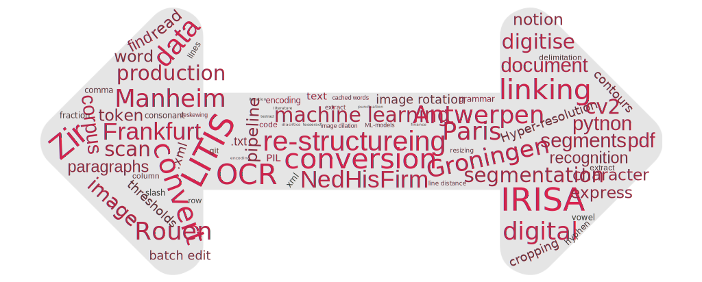

Welcome to the GitHub repository of the 2023 **Digitisation and OCR Workshop** for Eurhisfirm community memembers. This repository serves to facilitate the communication among participants. It hosts the presentations, summarizes key takeaways and offers space for code exchange.

Feel free to clone this repo and commit your contributions. If you have any troubble cloning or pushing to the directory, contact login at lilljegren dot com.

---

## Table of Contents

1. [Workshop Program](#program)
2. [Workshop Minutes](#minutes)
3. [Collaboration Organization](#coll)

---

## Workshop Program 

The workshop is held in two sessions during the whole day of May 4th in Groningen (NL).

| Time | Topic | Presenter |
|------|-------|-----------|
|08:30 - 09:30 |       |           |
|      |       |           |
|      |       |           |

Please push your presentations to the folder [**presentations**](presentations/).

## Workshop Minutes 

Please click on this [Link](minutes.md) to get to the workshop's summaries and key findings.

## Collaboration Organization 

This repository is intended to

- link to repositories maintained by workshop participants that might be valuable for the community
- host code snippets

When a participants wants to link a repository or project, please add the link to this document.
Code snippets can be stored in the folder [**code_snippets**](code_snippets/) in this repository.
